# 全国行政区域 4 级(省份、城市、区县、乡镇)经纬度数据及其获取

# 项目内容

一份**包含 中华人民共和国行政区划 4 级 省级、地级、县级、乡级(省、市、区、镇)行政区域的名称、编码以及经纬度数据文件**.

以及**获取经纬度的方法**.

预计包含 json xlsx sql 格式；数据在`pacs-data`文件夹下。

# 目录

<!-- START doctoc generated TOC please keep comment here to allow auto update -->
<!-- DON'T EDIT THIS SECTION, INSTEAD RE-RUN doctoc TO UPDATE -->

- [需求说明](#%E9%9C%80%E6%B1%82%E8%AF%B4%E6%98%8E)
- [包含哪些内容](#%E5%8C%85%E5%90%AB%E5%93%AA%E4%BA%9B%E5%86%85%E5%AE%B9)
  - [预期数据](#%E9%A2%84%E6%9C%9F%E6%95%B0%E6%8D%AE)
  - [用到的东西](#%E7%94%A8%E5%88%B0%E7%9A%84%E4%B8%9C%E8%A5%BF)
  - [开发测试环境](#%E5%BC%80%E5%8F%91%E6%B5%8B%E8%AF%95%E7%8E%AF%E5%A2%83)
- [测试使用说明](#%E6%B5%8B%E8%AF%95%E4%BD%BF%E7%94%A8%E8%AF%B4%E6%98%8E)
- [数据获取思路](#%E6%95%B0%E6%8D%AE%E8%8E%B7%E5%8F%96%E6%80%9D%E8%B7%AF)
  - [将 pcas-code.json 文件切分为以省为单位的小 json 文件](#%E5%B0%86-pcas-codejson-%E6%96%87%E4%BB%B6%E5%88%87%E5%88%86%E4%B8%BA%E4%BB%A5%E7%9C%81%E4%B8%BA%E5%8D%95%E4%BD%8D%E7%9A%84%E5%B0%8F-json-%E6%96%87%E4%BB%B6)
  - [前端获取经纬度](#%E5%89%8D%E7%AB%AF%E8%8E%B7%E5%8F%96%E7%BB%8F%E7%BA%AC%E5%BA%A6)
    - [怎样才能使用百度地图 JavaScript API?](#%E6%80%8E%E6%A0%B7%E6%89%8D%E8%83%BD%E4%BD%BF%E7%94%A8%E7%99%BE%E5%BA%A6%E5%9C%B0%E5%9B%BE-javascript-api)
    - [前端加载 pcas-code-provence-\*.json 文件,通过百度地图 API 获取经纬度](#%E5%89%8D%E7%AB%AF%E5%8A%A0%E8%BD%BD-pcas-code-provence-%5Cjson-%E6%96%87%E4%BB%B6%E9%80%9A%E8%BF%87%E7%99%BE%E5%BA%A6%E5%9C%B0%E5%9B%BE-api-%E8%8E%B7%E5%8F%96%E7%BB%8F%E7%BA%AC%E5%BA%A6)
    - [一切从简,简单准备](#%E4%B8%80%E5%88%87%E4%BB%8E%E7%AE%80%E7%AE%80%E5%8D%95%E5%87%86%E5%A4%87)
    - [前端获取经纬度核心代码](#%E5%89%8D%E7%AB%AF%E8%8E%B7%E5%8F%96%E7%BB%8F%E7%BA%AC%E5%BA%A6%E6%A0%B8%E5%BF%83%E4%BB%A3%E7%A0%81)
  - [后端保存数据](#%E5%90%8E%E7%AB%AF%E4%BF%9D%E5%AD%98%E6%95%B0%E6%8D%AE)
- [按需处理数据](#%E6%8C%89%E9%9C%80%E5%A4%84%E7%90%86%E6%95%B0%E6%8D%AE)
  - [目前还是有以下问题:](#%E7%9B%AE%E5%89%8D%E8%BF%98%E6%98%AF%E6%9C%89%E4%BB%A5%E4%B8%8B%E9%97%AE%E9%A2%98)
    - [1 某些 pcas-code.json 文件中的地区取不到经纬度](#1-%E6%9F%90%E4%BA%9B-pcas-codejson-%E6%96%87%E4%BB%B6%E4%B8%AD%E7%9A%84%E5%9C%B0%E5%8C%BA%E5%8F%96%E4%B8%8D%E5%88%B0%E7%BB%8F%E7%BA%AC%E5%BA%A6)
    - [~~2 某些地区通过百度地图 JS API 查询出来的经纬度可能不准确(20201215 已更新)~~](#2-%E6%9F%90%E4%BA%9B%E5%9C%B0%E5%8C%BA%E9%80%9A%E8%BF%87%E7%99%BE%E5%BA%A6%E5%9C%B0%E5%9B%BE-js-api-%E6%9F%A5%E8%AF%A2%E5%87%BA%E6%9D%A5%E7%9A%84%E7%BB%8F%E7%BA%AC%E5%BA%A6%E5%8F%AF%E8%83%BD%E4%B8%8D%E5%87%86%E7%A1%AE20201215-%E5%B7%B2%E6%9B%B4%E6%96%B0)
  - [处理成一整份 JSON 文件.](#%E5%A4%84%E7%90%86%E6%88%90%E4%B8%80%E6%95%B4%E4%BB%BD-json-%E6%96%87%E4%BB%B6)
  - [处理成 sql 文件](#%E5%A4%84%E7%90%86%E6%88%90-sql-%E6%96%87%E4%BB%B6)
  - [处理成 xlsx 文件](#%E5%A4%84%E7%90%86%E6%88%90-xlsx-%E6%96%87%E4%BB%B6)
- [更新说明](#%E6%9B%B4%E6%96%B0%E8%AF%B4%E6%98%8E)
  - [20201215 更新](#20201215-%E6%9B%B4%E6%96%B0)
    - [关于查询的经纬度反查出来的详细地址与行政区域地址差别较大的问题](#%E5%85%B3%E4%BA%8E%E6%9F%A5%E8%AF%A2%E7%9A%84%E7%BB%8F%E7%BA%AC%E5%BA%A6%E5%8F%8D%E6%9F%A5%E5%87%BA%E6%9D%A5%E7%9A%84%E8%AF%A6%E7%BB%86%E5%9C%B0%E5%9D%80%E4%B8%8E%E8%A1%8C%E6%94%BF%E5%8C%BA%E5%9F%9F%E5%9C%B0%E5%9D%80%E5%B7%AE%E5%88%AB%E8%BE%83%E5%A4%A7%E7%9A%84%E9%97%AE%E9%A2%98)
    - [有趣的现象](#%E6%9C%89%E8%B6%A3%E7%9A%84%E7%8E%B0%E8%B1%A1)

<!-- END doctoc generated TOC please keep comment here to allow auto update -->

# 需求说明

无论前后端,在设计到行政地址坐标的时候,都会有这个“中国行政区域地址坐标”的需求.常见的就只需要到省、市、区 3 级即可,特殊一点的会到镇级、村级.随着级别越深,数据越大,管理越麻烦.

关于"中华人民共和国行政区划（五级）：省级、地级、县级、乡级和村级"数据获取,根据一段时间的查找、收集、比较,在 github 中的[Administrative-divisions-of-China](https://github.com/modood/Administrative-divisions-of-China)这个项目是比较复合要求和很多使用者的支持的.

如果只是需要行政区域名称和编码的话,这份资料以及足够了.例如我只需要到镇级的行政名称和编号,其 pcas-code.json 文件,如下图

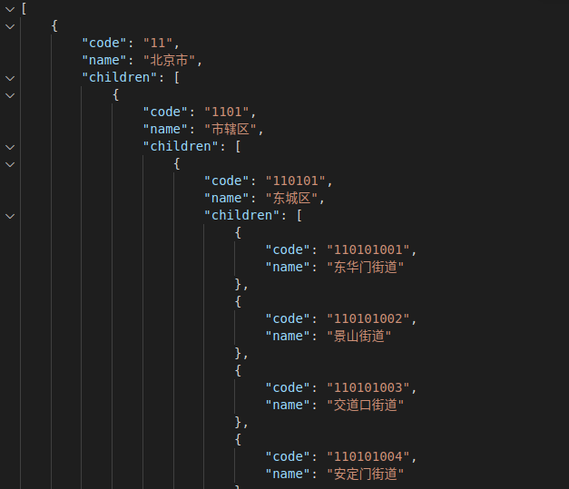

但是在遇到地图相关应用时,**需要每个到镇级的经纬度坐标**,这个需求,我目前是没有找到比较好的数据.

有找到一份数据,号称有["全国城市+四级城市地址+邮编+区号+经纬度 sql 数据表"](https://github.com/kbdxbt/area_sql),但是其 sql 文件中只有 3 层,如下:

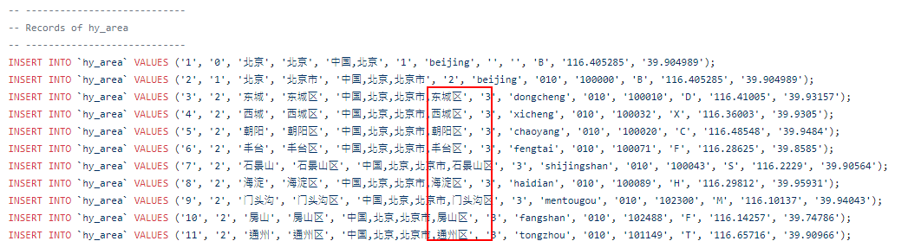

且这份文件作者已经 2 年未更新了(2018/6/8 之后).

因此,我需要一份数据,**包含 4 级(省、市、区、镇)行政区域的名称、编码以及经纬度**,目前没找到合适的,所以需要动手自己去获取.

# 包含哪些内容

## 预期数据

数据在`pcas-data`文件夹下，如下图：

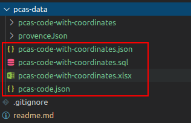

**pcas-code.json** 为 [Administrative-divisions-of-China](https://github.com/modood/Administrative-divisions-of-China)项目中`省份、城市、区县、乡镇” 四级联动数据`文件。  
**pcas-code-with-coordinates.json** 为以`pcas-code.json`为基准，生成的带**经纬度数据**并**拍平结构**的数据文件(存入关系型数据库更方便)。  
**pcas-code-with-coordinates.sql** 为`pcas-code-with-coordinates.json`数据的 sql 版本。  
**pcas-code-with-coordinates.xlsx** 为`pcas-code-with-coordinates.json`数据的 xlsx 表格版本。

## 用到的东西

1 简单的 nodejs fs 模块文件读写的使用  
2 最基础的 angular 使用(前端载体,其他任何同样功能工具都可以)  
3 最基础的 koa 及相关必要组件的最简单的使用  
4 百度地图 JavaScript API 几个基础接口的使用  
5 简单的 json to xlsx 文件转换  
……

## 开发测试环境

OS:Ubuntu18.04  
nodejs:14.15.0  
chrome:86  
angular:10.2  
百度地图 js API:3.0

# 测试使用说明

`gpfbm-angular` 为 angular 项目,需要本地安装相关 cli,然后进入该文件加下运行`ng serve -o`本地测试启动  
`gpfbm-backend` 为 nodejs 项目,需要本地安装 nodejs(推荐当前最新稳定版本),然后进入该文件加下运行`node koaServer.js`本地测试启动

# 数据获取思路

很简单,`Administrative-divisions-of-China`这个项目已经有比较好的行政区域名称、编码数据了,我们只需要把每个区域名称补入经纬度即可.

从何处获取经纬度?目前没有得到现成的,我的做法是,使用百度地图 JavaScript API,通过其**地址解析**接口,遍历逐条获取.

几个问题:

1 百度地图 JavaScript API 只有在浏览器端是免费的.

2 全国有四五万个到镇级的行政区域.

3 不管直接 html、 vue 、angular、 ... 前端没有直接的文件系统,chrome 之前有实验性质新特性 API 可直接关联操作系统的文件系统,(⊙o⊙)…,没必要，先 pass 了.

所以,整体思路就是  
1 先把 `pcas-code.json` 文件分为小份,每次处理一个或少数几个省；  
2 前端调用百度地图 js API,循环递归调用地址解析接口,把结果拼接成适合的结构；  
3 把该结果传递给后台,由后台写入文件；  
4 按照需求，把文件合并、修改结构、转换为其他格式等等……

后台很简单,简单用 koa 写个 http server,然后用 nodejs 的 fs 模块把数据写入文件即可.有效代码也就 20 来行。

## 将 pcas-code.json 文件切分为以省为单位的小 json 文件

我在编写此文时(20201209),从`Administrative-divisions-of-China`项目中获取到的最新的 4 级行政区域名称及编号 json 文件 `pcas-code.json` 是 2020/11/06 的(2.4.0 版本).如果后续有最新的,可以自行去获取.下文以 2.4.0 版为例说明.

这份文件 `pcas-code.json` 格式化之后有 18w+行,也就是说有四五万个到乡镇的数据,前端单页面去一次性请求完我是没有成功的,是可能有内存不足、存储不足等问题,一个多小时就没了.所以我的计划是切成单独的省,分为 31 个(其不含港澳台),一次性少请求几个省的即保证成功,也尽量安全.

可以从 `pcas-code.json` 文件里面意义复制出来,或者使用本项目中 `gpfbm-backend/utils/SplitPcasJson/splitPcasJson.js`,会在`pcas-data`生一个<span   id="provenceJson">"provenceJson"文件夹</span>,其中会生成 31 个小文件,如下图(**请查看修改使用时注意事实的文件读写地址**)

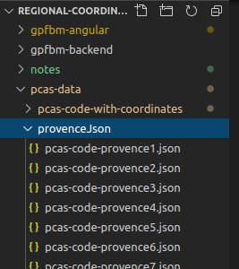

## 前端获取经纬度

### 怎样才能使用百度地图 JavaScript API?

先去[百度地图开放平台](https://lbsyun.baidu.com/)注册个个人开发者帐号(图简单的话).

然后进入控制台-> 我的应用,创建一个浏览器端应用.得到访问应用（AK）,这个就是调用百度地图 JavaScript API 的凭证了.

使用的相关接口,就是  
[逆/地址解析](http://lbsyun.baidu.com/index.php?title=jspopular3.0/guide/geocoding)

`BMap.Geocoder().getPoint()`通过名称获取经纬度.

~~`BMap.Geocoder().getLocation()`通过经纬度获取地址名称.~~

[检索 POI](http://lbsyun.baidu.com/index.php?title=jspopular3.0/guide/search)

`BMap.LocalSearch()`通过名称获取详细地址信息.

使用示例可直接看[官网](http://lbsyun.baidu.com/jsdemo.htm#i1_4)(推荐),或看`gpfbm-backend/百度地图API批量地址解析示例.html`(前者)文件.

### 前端加载 pcas-code-provence-\*.json 文件,通过百度地图 API 获取经纬度

一开始我是在使用[vue-typescript-admin-template](https://github.com/Armour/vue-typescript-admin-template)模板的已有项目里面引入百度地图 JavaScript API 的,但是这个引入按照网上找的示例没有成功.同事使用 JavaScript 版本的 VUE 引入是非常正常的.但因为我突然发现好久没有写 angular 了,就新建了空 angular 项目,引入百度地图 JavaScript API.

以下内容就是在 angular 项目 demo 中为例子了,如果是 vue,我建议使用 js 开发的引入可以方便些,其他的请自行处理,**也就调用一两个接口的问题,大概看个思路就好了.**

值得一体的是,一开始我想的是直接写一个 html 文件就好了,不过一万年没用过 jquery 了,加上麻烦的跨域问题和自认为应该很少前端开发不会用框架了,加上私心,就简单用 angular 引入 API 之后操作了.

对应 angular 项目就是`gpfbm-angular`(gpfbm 为 Get Point From BaiduMap)

### 一切从简,简单准备

1 src/index.html 中引入百度地图 js API

```js
<script
  type="text/javascript"
  src="http://api.map.baidu.com/api?v=3.0&ak=your-ak"
></script>
```

2 src/app/app.module.ts 引入 HttpClientModule

```ts
...
 imports: [
    BrowserModule,
    HttpClientModule
  ],
  ...
```

3 src 下创建一个加载前端本地 json 文件的 service,内容大概如下图:

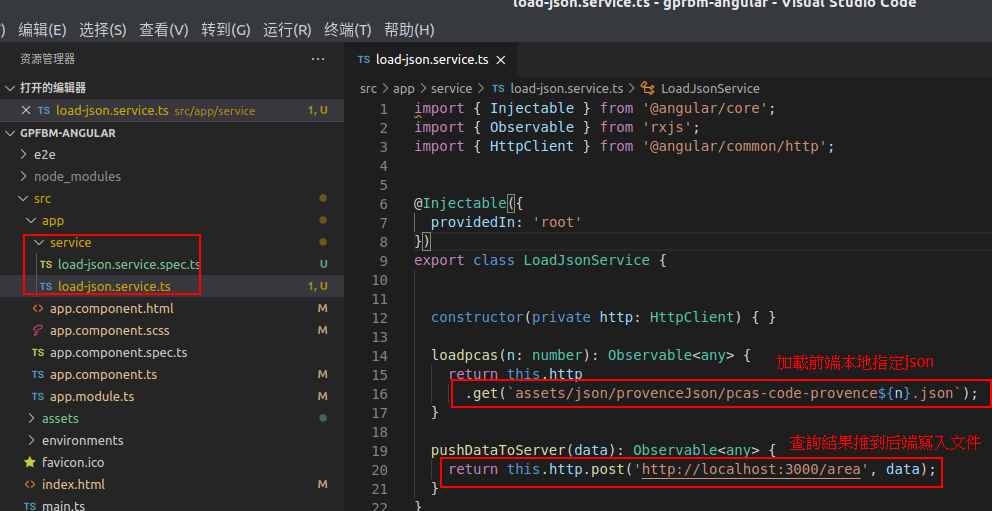

4 在 src/assets/下放入之前 切分的 provenceJson 下小 pcas-code-provence\*.json 文件(第 3 步 service 中读取的位置,也就是[这个](#provenceJson).

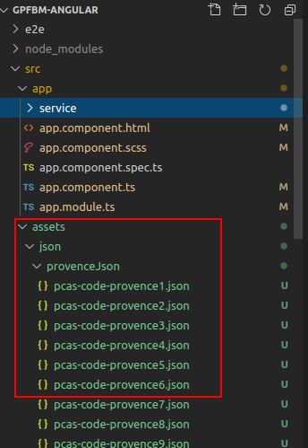

### 前端获取经纬度核心代码

src/app/app.component.html 中放 2 个 div,一个显示地图,确认百度地图 JS API 正常运行.一个简单放个按钮,用于点击开始请求经纬度.

_在对应 scss 中记得给显示地图的 div 具体指定宽高,否则可能地图变成一条线看不见_

主要内容(具体看 src/app/app.component.ts 文件)

1 ngOnInit()中初始化地图和需要相关内容，主要看 API 是否正常可用。

```ts
ngOnInit(): void {
  // 创建地图实例
  this.map = new BMap.Map('map-container');
  // 初始化地图，设置中心点坐标和地图级别
  this.point = new BMap.Point(116.4133836971231, 39.91092462465681);
  this.map.centerAndZoom(this.point, 15);
  // 鼠标滑轮缩放地图
  this.map.enableScrollWheelZoom(true);

  // 初始化Geocoder
  this.pointGeo = new BMap.Geocoder();

}
```

2 指定父级区域下指定行政地区 查询经纬度

~~可以看到,我先通过名称查询到经纬度,但经纬度很详细,我又用它反查出具体地点,后者没需求可以不要~~

此外,为了提高命中率,如果某个地区(例如镇)在指定的上一级(例如区)内查不到,则直接指定最顶级(省)内去查询.但结果可能会有较大误差(如文章开头所见)。

```ts
  /**
   * 指定父级区域下指定行政地区 查询经纬度
   * @param areaName 需要查询经纬度的行政区域名称
   * @param parentArea  需要查询经纬度的行政区域的上一级区域名称
   * @param mergeParent 是当前指定查询行政地区的所有上级地区拼接的字符串,
   *            如果在 parentName 内查不到结果,那就用此拼接的值按照某种切割,使用 parentName上级范围去查
   * @param areaCode 需要查询经纬读的行政区域在pcas-code.json文件的code,不做操作,仅仅最后拼接所用
   * @param level 当前数据是第几层,也就是行政级别的第几层(省为1,市为2 ...),不做操作,仅仅最后拼接所用
   */
  getPoint(areaName, parentArea, mergeParent, areaCode, level): any {
    return new Promise((resolve, reject) => {

      // 预设好返回百度地图js API返回手动拼接的数据结构
      let areaObj = {
        name: areaName,
        code: areaCode,
        level,
        mergeName: mergeParent + ',' + areaName,
        lng: 0,
        lat: 0,
        info: ''
      };

      // 查询指定父级区域内指定区域的经纬度
      this.pointGeo.getPoint(areaName, (point) => {
        if (point) {
          const address = new BMap.Point(point.lng, point.lat);

          // 能够直接查到经纬度的结果
          areaObj.lng = address.lng;
          areaObj.lat = address.lat;
          areaObj.info = '直接查询获得';

          resolve({ area: areaObj });
        } else {
          /**
           * 如果某个地区(例如镇)在指定的上一级(例如区)内查不到,则直接指定最顶级(省)内去查询,提高查询命中率
           */
          let tempArr = mergeParent.split(",");
          if (tempArr.length > 1) {
            this.pointGeo.getPoint(areaName, (p) => {
              if (p) {
                const addr = new BMap.Point(p.lng, p.lat);

                // 将父级区域提升到省级查到的结果
                areaObj.lng = addr.lng;
                areaObj.lat = addr.lat;
                areaObj.info = '第二次通过省份查询成功';

                resolve({ area: areaObj });
              } else {
                // 没查到经纬度的区域也要记录(20201211 实测父级到省了都查得到)
                areaObj.info = '根据地址名称两次查询都查不到经纬度';
                resolve({ noLngLat: areaObj });
              }
            }, (tempArr.slice(0, 1)).join(''))
          }
        }
      }, parentArea);
    });
  }
```

~~看完之后,可能会觉得只是需要指定地址的经纬度,没必要再反查地址了(getLocation).~~

~~这是应该的,那只需把 getLocation 那一段删掉,直接 resolve 结果就好.但我在用的时候,就遇到了地址查到了经纬度,但反查失败的案例,虽然极少数,但还是发生,原因也不清楚,所以才搞了这么一个反解析.~~

拼接后正常可查到经纬度的结果,大概会是这个样子(**根据实际需求,可以拼成任何自己想要的结构,毕竟数据都有了**)

```
[
    ...
    {
        "area": {
            "name": "展览路街道",
            "code": "110102009",
            "level": 4,
            "mergeName": "北京市,北京市,西城区,展览路街道",
            "lng": 116.34680704187879,
            "lat": 39.937293047224934
        }
    },
    ...
]
```

3 递归查询 pcas-code 文件中各级区域地址的经纬度

```ts
  /**
   * 逐层递归调用获取指定 区域的经纬度函数
   * @param data json数据源中的数据及其子数组
   * @param level 当前数据是第几层,也就是行政级别的第几层(省为1,市为2 ...)
   * @param mergeParent 是当前指定查询行政地区的所有上级地区拼接的字符串,
   *            如果在 parentName 内查不到结果,那就用此拼接的值按照某种切割,使用 parentName上级范围去查
   * @param parentName 当前查询 行政名称A 的上一级名称B(从B中找A,避免A在不同大的省市区中有重名)
   */
  async getChilds(data, level, mergeParent = '', parentName = ''): Promise<any> {

    if (Array.isArray(data)) {
      // tslint:disable-next-line: prefer-for-of
      for (let index = 0; index < data.length; index++) {
        const e = data[index];

        // 万一害怕百度地图API服务器显示,每个地址请求之后,间隔一点时间(不建议,几万个每个都间隔一点,猴年马月能查完啊)
        // this.sleep(1000);
        let rst;
        if (!parentName) {
          rst = await this.getPoint(e.name, e.name, e.name, e.code, level);
        } else {
          rst = await this.getPoint(e.name, parentName, mergeParent, e.code, level);
        }

        // 不同结果存入不同内容
        if (rst.noLngLat) {
          this.resultNoLngLatArr.push(rst.noLngLat);
          // 为了保持数据完整,即便没有查询到经纬度,也把该行政区域放进去,只不过经纬度为0而已
          this.resultAreaArr.push(rst.area);
        }
        if (rst.area) {
          this.resultAreaArr.push(rst.area);
        }

        if (e.children) {
          if (e.children.length > 0) {
            /**
             * 这个地方是因为,pcas-code.json文件 有些市级和区级是一样名称的地区,如果拼接到一起,百度地图的API无法识别
             * 例如 横沥镇 东坑镇 在广东省(省)东莞市(市)东莞市(区) 下,调用百度地图API寻找 广东省东莞市东莞市是找不到那两个镇的,在广东省东莞市 下可以
             * 又如  东华门街道 景山街道 在北京市(省)市辖区(市)东城区(区)下,调用百度地图API寻找 北京市市辖区东城区 下也找不到,在北京市东城区 下可以
             */
            let newParent = '';
            let newMergeParent = '';
            if (parentName.includes(e.name) || e.name === '市辖区') {
              newParent = parentName;
            } else {
              newParent = parentName + e.name;
            }
            // 这个mergeParent用于查询时已经只取省份了，所以不用提出同名（城市、区县和“直辖市”）
            newMergeParent = mergeParent ? mergeParent + ',' + e.name : e.name;

            await this.getChilds(e.children, level + 1, newMergeParent, newParent);
          }
        }
      }
    }
    return;
  }
```

4 批量导入 json,查询结果,每个 json 文件完成后,传给后台（**注意 for 循环说明**）

```ts
    // 获取经纬度并传给后台处理
  async handlePcas(): Promise<any> {

    // tslint:disable-next-line: no-console
    console.time('total');
    // 这个31,其实就是拆分的小pcas-code-*.json文件的数量,31个省,但最好不要一次性就遍历处理31个,崩溃啊,溢出啊,挺麻烦的
    // 三五个一次吧,改动这个for循环就好
    for (let n = 27; n <= 31; n++) {

      try {
        const res = await this.ljs.loadpcas(n).toPromise();
        if (!res) {
          break;
        }
        // tslint:disable-next-line: no-console
        console.time(`start${n}`);
        console.log(`开始查询...${n}`);
        await this.getChilds(res, 1);
        // tslint:disable-next-line: no-console
        console.timeEnd(`start${n}`);

        const data = {
          area: this.resultAreaArr, // 成功查到经纬度的结果
          noLngLat: this.resultNoLngLatArr.length > 0 ? this.resultNoLngLatArr : '', // // 查不到经纬度的结果,如果为空,给后台传空
          name: `pcas-code-provence${n}-with-coordinates` // 后台保存文件的名称
        };
        try {
          const writeRst = await this.ljs.pushDataToServer(data).toPromise();
          // 每个省份的文件处理完,把结果数组清空(2选一的写法,都写上示意)
          this.resultAreaArr.length = 0;
          this.resultAreaArr = [];
          this.resultNoLngLatArr.length = 0;
          this.resultNoLngLatArr = [];

          if (writeRst.code !== 20000) {
            break;
          }
        } catch (error) {
          console.log('等待后台写入文件失败');
        }
      } catch (error) {
        console.log(`加载pacs-code-provence${n}.json文件失败`);
      }
    }
    // tslint:disable-next-line: no-console
    console.timeEnd('total');
  }
```

可以看出，我尽量把所有请求都搞成同步的，一个请求成功了才执行下一个请求。不为别的，就是怕万一百度把我号封了。

angular 里面或许直接 console.time 有警告,为了看到大概耗时,还是用了.

当然，既可以按照需求改成自己想要的少量异步（耗时理应更少），也可以做其他处理，符合自己需求即可。

不用担心百度地图服务器查不到结果报错导致整个程序就卡主了（这其实就是我的写法目的），只要网络连接正常，请求几千个是不会请求失败的。万一失败了，再跑一次嘛，后端也是单个省一个文件处理，问题不大。

从前端通过百度地图 API 查到经纬度数据，传到后台，拼接成单个省 json 文件，总体的耗时情况（前者还在做其他事，后者下班挂机测试。）：

分三次结果：(1096+1404+1531)/60，约为 67 分钟。
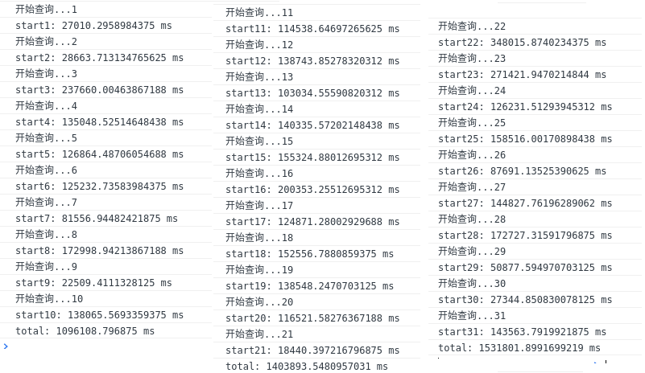
一次性查完：(3583)/60，约为 60 分钟。
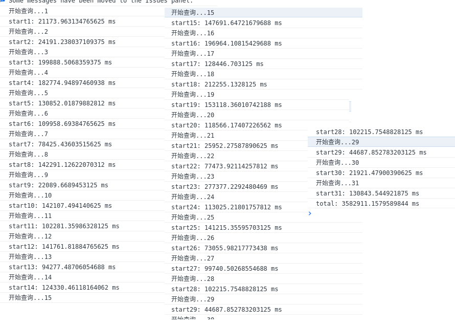

## 后端保存数据

后端代码就比较简单了,只是把接收数据,写入文件而已,把不同的结果,存入不同的文件。

具体看 `koaServer.js`文件

```js
const Koa = require("koa");
const app = new Koa();
const Router = require("koa-router");
const fs = require("fs");
const koaBody = require("koa-body");
app.use(koaBody());
const cors = require("koa2-cors");
app.use(cors());

// 子路由
let page = new Router();

page.post("/area", async (ctx) => {
  let body = ctx.request.body;
  let { area, noArea, noLngLat, name } = body;

  try {
    // pcas-data文件夹下要手动新建一个 pcas-code-with-coordinates 文件夹,否则出错(为了方便不做检查和代码创建)
    let jsonFileSavePath = `../pcas-data/pcas-code-with-coordinates`;

    if (!fs.existsSync(jsonFileSavePath)) {
      fs.mkdirSync(jsonFileSavePath);
    }
    if (area) {
      fs.writeFileSync(
        `${jsonFileSavePath}/${name}.json`,
        JSON.stringify(area),
        "utf-8"
      );
    }
    if (noLngLat) {
      fs.writeFileSync(
        `${jsonFileSavePath}/${name}-指定区域地址查不了经纬度.json`,
        JSON.stringify(noLngLat),
        "utf-8"
      );
    }

    ctx.response.type = "json";
    ctx.response.body = { code: 20000, info: "done" };
  } catch (error) {
    console.error(error);
    ctx.response.type = "json";
    ctx.response.body = { code: 20001, info: "fail", msg: error };
  }
});

// 装载所有子路由
let router = new Router();
router.use("", page.routes(), page.allowedMethods());

// 加载路由中间件
app.use(router.routes()).use(router.allowedMethods());

app.on("error", (err, ctx) => {
  log.error("server error", err, ctx);
});

app.listen(3000, () => {
  console.log("koa server is running at port 3000");
});
```

# 按需处理数据

到目前位置,按道理是可以获取到所有省到镇级的行政区域的名称、编号、经纬度等数据了.

## 目前还是有以下问题:

### 1 某些 pcas-code.json 文件中的地区取不到经纬度

百度地图 API 中使用的行政区域名称和 pcas-code.json 文件的不一定一致,就会出现查不到经纬度的地址

(就是`pcas-code-provence*-with-coordinates-指定区域地址查不了经纬度.json`文件).

这已经是查询过两次的结果了，例如直接在 `海南省省直辖县级行政区划琼中黎族苗族自治县`里面查询`上安乡`没有结果，我已经再使用`海南省`里面去查询`上安乡`，假如还是没结果（实际上是查得到），那我也暂时就不过多处理了。

(20201211)这我就还没有想到办法,只能手动去[百度地图拾取坐标系统](https://api.map.baidu.com/lbsapi/getpoint/index.html)输入这份文件中的`mergeName+name`手动获取经纬度拼接了.

### ~~2 某些地区通过百度地图 JS API 查询出来的经纬度可能不准确(20201215 已更新)~~

<span id="jump">百度地图 API 得到的经纬度用百度坐标拾取反查,可能过于详细,区域名称与实际差别较大.</span>

**特别说明：使用百度地图 js API 地址解析接口获得，其经纬度数据不一定准确。**

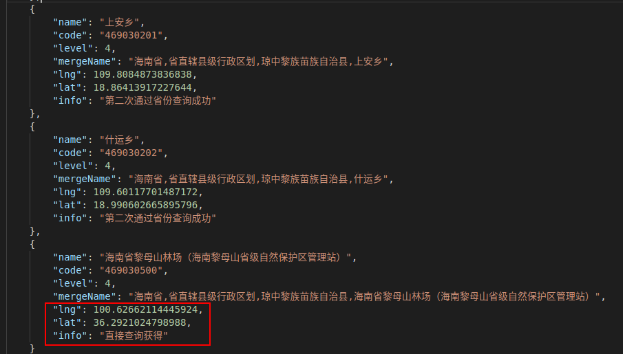

这个问题开，这么多地区，我也不知道哪些 API 查出来的结果不准确，还在思考当中（20201211）

## 处理成一整份 JSON 文件.

这简单 fs 再读写以下文件成大 json 即可.

可参看 `gpfbm-backend/utils/CombineJsonFiles/combine.js`,思路就是 读、追加写、读、遍历替换"]["、写。

**注意，因为是要替换“][”，所以不能先格式化成 json 显示格式，不然就匹配不到。**

运行之后会有一份`gpfbm-backend/pcas-data/pcas-code-with-coordinates.json`文件，包含所有镇级地址及其经纬度数据。

## 处理成 sql 文件

json to csv / to xlsx 都是比较简单的,去 npm 简单搜一下工具包就好.

不过转成 sql 的话歧义比较多,主要是用于 json 形式 builder 指定 sql 语句.我还是觉得直接简单用 nodejs 的 fs 模块读读拼拼写写顺手些.

可参看 `gpfbm-backend/utils/ExportToSql/toSql.js`,思路就是 写、读、追加写，是利用上一节生成的`pcas-code-with-coordinates.json`转成 sql 文件。

运行之后会有一份`gpfbm-backend/pcas-data/pcas-code-with-coordinates.json`文件，包含所有镇级地址及其经纬度数据。

## 处理成 xlsx 文件

我使用的是 npm 库[excel4node](https://www.npmjs.com/package/excel4node)，将 json 转为 xlsx，可参看 `gpfbm-backend/utils/ExportToXlsx/exportXlsxFromJson.js`,

运行之后会有一份`gpfbm-backend/pcas-data/pcas-code-with-coordinates.xlsx`文件，包含所有镇级地址及其经纬度数据。

# 更新说明

## 20201215 更新

### 关于查询的经纬度反查出来的详细地址与行政区域地址差别较大的问题

前者已经地位到比较细节了(经纬度小数点后 14 位,而后者是一个乡镇,所以显示的文字差别挺大)

之前直接使用百度地图 API 的 GetPoint()接口,会出现偏差特别大的结果,例如[上面截图](#jump)所示,指定省市区查询镇有直接结果,但从海南跑到了青海(内部有个以"海南"为名的行政).

我找到另外一个接口 LocalSearch(),指定区域内搜索地址,这样以文字搜地址,从效果来看,第一个预留地址与实际预计查询结果最接近.例如上述问题(大致位置是正确的~~至少在同个区县~~:

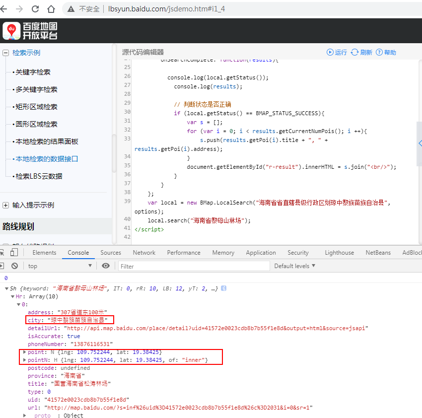

所以,有改查询经纬度接口调用逻辑,先 LocalSearch(),再 GetPoint(),详情查看`gpfbm-angular/src/app/app.component.ts`之`localSearch()`.

**三点说明**  
1 这个接口返回的经纬度精度小数点后 4 位.  
2 有些乡镇还有带括号,我查下时只取括号外的查询(几个抽样,外部查询结果大致正确,里面查就找不到地址.)  
3 直接上层全部拼接更详细,反而有可能查不到结果

(例如单独在"贵州省"或"黔东南苗族侗族自治州"或"剑河县"下搜索"柳川镇",[状态码](http://lbsyun.baidu.com/cms/jsapi/reference/jsapi_reference_3_0.html#a7b57)结果就是 0`BMAP_STATUS_SUCCESS`,检索成功.  
但以上任意相邻两个的组合或者三者组合"贵州省黔东南苗族侗族自治州剑河县"下搜索"柳川镇",localSearch 返回`状态码`为 2 : `BMAP_STATUS_UNKNOWN_LOCATION`,找不到位置.有的返回就可能是 1 : `BMAP_STATUS_CITY_LIST`,很多市级地区有同名的乡镇,即便已经指定了市级名称)

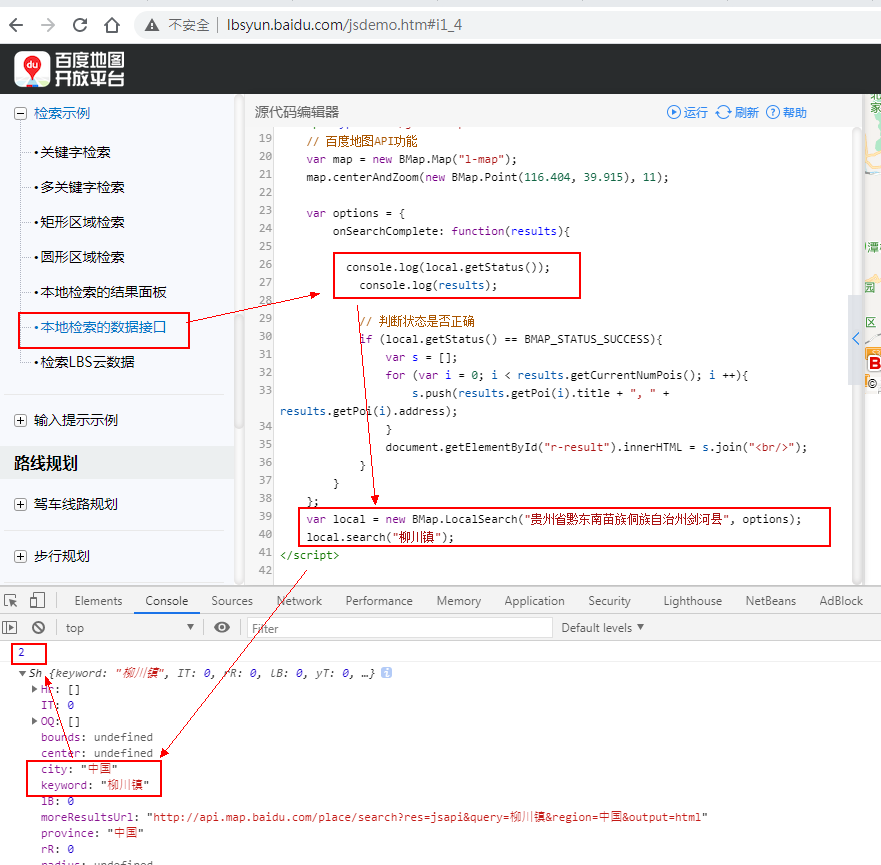

### 有趣的现象

今天(20201215)碰巧看到`pcas-code.json`文件里面,居然有行政名称带有问号?,其实在国家统计局网站上显示就是问号,所以爬虫抓下来也是。分别是

```
江西省 吉安市 新干县 麦?镇 (360824104)
广东省 湛江市 吴川市 塘?镇 (440883107)
四川省 成都市 大邑县 ?江镇(510129106)
贵州省 黔东南苗族侗族自治州 岑巩县 ?水街道(522626001)
```

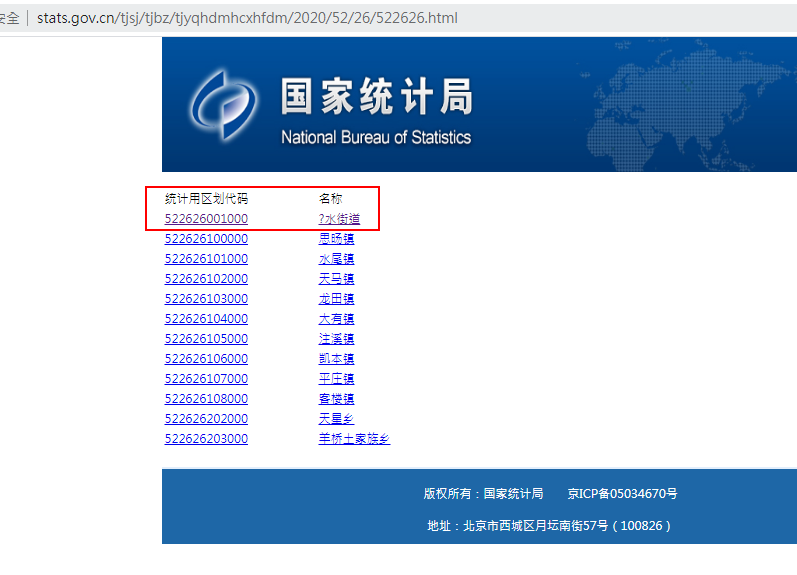

但这些镇,通过 `LocalSearch()`可以查到,结果却不知道到底是什么了,因为直接的坐标拾取效果是一样的...


### 后台简单记录耗时日志

因为之前的计时也就是`console.time()`写在前台,一卡住重新运行什么的就没有了,便用log4js记录每次数据传到后台时的时间,那第一个查询开始时也给后台发个请求,记录开始的时间,并把日志写到log文件,这样就可以看到全部执行或单个执行大概用了多久了.具体配置可见`gpfbm-backend/Log4Config.js`